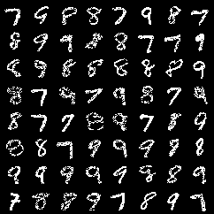
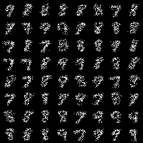

# unified-constraints-pc
 
  
### To Run
Create a config file for your experiment, specifying the model to be used and the hyperparameters, inside `configs/`.

Currently supported model classes:
- RatSpn
- EinsumNet
- EinsumFlow

Use the following command to launch the experiment:

```python
 python train_ucpc.py --config_file=PATH_TO_CONFIG
```

### Datasets

#### 1. `set-mnist-K`

`set-mnist-K` is a variation of the MNIST image dataset comprising of digits 0-9. Each image is rasterized and converted into a set of 1D coordinates of non-zero pixels. Finally, `K` number of non-zero pixels are sampled to represent each image.

To generate the Set-MNIST dataset, use the `gen_set_mnist.py` script. This script loads the MNIST dataset, binarizes the images, and converts them into sets of adjustable cardinality (`K`), comprising coordinates of non-zero pixels. To generate the dataset, run:

```python
python gen_set_mnist.py 
```
The digits to include can also be specified in the above python file. Below is a visualization of a generated set-mnist dataset with `K=100` and `digits=[7,8,9]`

</img>


## Results

#### `set-mnist-100`

Results on Einsum Networks with Categorical leaf variables and `num_sums=10`, `num_input_distributions=10`, `num_repetition=5`, `depth=6`

The generalization constraint helps capture the set symmetry of permutation invariance and achieve higher test log likelihoods and sample quality.


<table>
  <tr>
    <td> 
    </img>
    </td>
    <td>
     </img>
     </td>
  </tr>
  <tr>
   <td> 
    Einsum Network trained <b>without generalization constraint</b> at the end of 500 epochs.
    </td>
    <td>
    Einsum Network trained <b>with generalization constraint</b> at the end of 500 epochs.
    </td>
  </tr>
</table>
